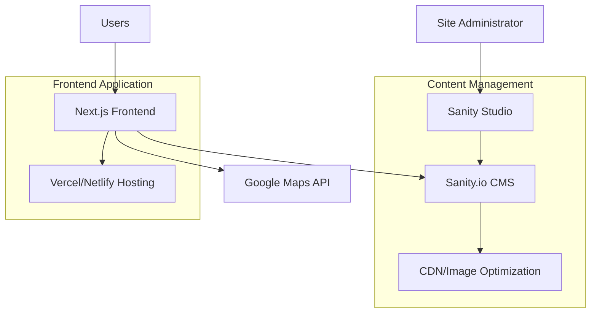

# Design Document

## Overview

The petting zoo directory transformation will leverage the existing Next.js + Sanity.io architecture while adapting the data models, user interface, and content structure to serve petting zoo discovery and information needs. The system will maintain the proven JAMstack approach with server-side rendering for SEO while introducing petting zoo-specific features like animal categorization, facility amenities, and enhanced location services.

## Architecture

### High-Level Architecture


### Technology Stack
- **Frontend**: Next.js 13+ with App Router, React 18+, TypeScript
- **CMS**: Sanity.io v3 with Sanity Studio
- **Maps**: Google Maps JavaScript API with Places API
- **Hosting**: Vercel (recommended) or Netlify
- **Image Management**: Sanity's built-in image optimization
- **Styling**: CSS Modules or Tailwind CSS for responsive design

## Components and Interfaces

### Frontend Components

#### Core Layout Components
- **Header**: Navigation with logo, search functionality
- **Footer**: Contact information, links, social media
- **Layout**: Wrapper component for consistent page structure

#### Petting Zoo Components
- **PettingZooCard**: Grid item showing zoo preview (image, name, rating, location)
- **PettingZooGrid**: Container for zoo cards with responsive layout
- **PettingZooDetail**: Full zoo information page component
- **AnimalSection**: Display animals available at each zoo
- **AmenitiesSection**: Show facility features (parking, restrooms, etc.)

#### Interactive Components
- **SearchBar**: Location and keyword search functionality
- **FilterPanel**: Animal types, amenities, distance filters
- **MapView**: Interactive map with zoo markers
- **ReviewSection**: Display and manage visitor reviews
- **ImageGallery**: Responsive image carousel for zoo photos

#### Utility Components
- **LoadingSpinner**: Loading states for async operations
- **ErrorBoundary**: Error handling and fallback UI
- **SEOHead**: Dynamic meta tags for each page

### API Interfaces

#### Sanity GROQ Queries
```javascript
// Get all petting zoos for homepage
const zooListQuery = `*[_type == "pettingZoo"] | order(name asc) {
  _id,
  name,
  slug,
  mainImage,
  location,
  admissionPrice,
  rating,
  reviewCount,
  "animals": animals[]->name
}`

// Get single zoo with full details
const zooDetailQuery = `*[_type == "pettingZoo" && slug.current == $slug][0] {
  ...,
  "animals": animals[]->{
    _id,
    name,
    type,
    description,
    image
  },
  "reviews": reviews[]->{
    ...,
    visitor->{
      name,
      image
    }
  }
}`
```

## Data Models

### Petting Zoo Schema
```javascript
{
  name: 'pettingZoo',
  title: 'Petting Zoo',
  type: 'document',
  fields: [
    {
      name: 'name',
      title: 'Zoo Name',
      type: 'string',
      validation: Rule => Rule.required()
    },
    {
      name: 'slug',
      title: 'URL Slug',
      type: 'slug',
      options: { source: 'name' }
    },
    {
      name: 'description',
      title: 'Description',
      type: 'text'
    },
    {
      name: 'location',
      title: 'Location',
      type: 'geopoint'
    },
    {
      name: 'address',
      title: 'Street Address',
      type: 'string'
    },
    {
      name: 'phone',
      title: 'Phone Number',
      type: 'string'
    },
    {
      name: 'website',
      title: 'Website',
      type: 'url'
    },
    {
      name: 'operatingHours',
      title: 'Operating Hours',
      type: 'object',
      fields: [
        { name: 'monday', type: 'string' },
        { name: 'tuesday', type: 'string' },
        // ... other days
      ]
    },
    {
      name: 'admissionPrice',
      title: 'Admission Price',
      type: 'object',
      fields: [
        { name: 'adult', type: 'number' },
        { name: 'child', type: 'number' },
        { name: 'senior', type: 'number' }
      ]
    },
    {
      name: 'mainImage',
      title: 'Main Image',
      type: 'image',
      options: { hotspot: true }
    },
    {
      name: 'images',
      title: 'Additional Images',
      type: 'array',
      of: [{ type: 'zooImage' }]
    },
    {
      name: 'animals',
      title: 'Animals',
      type: 'array',
      of: [{ type: 'reference', to: [{ type: 'animal' }] }]
    },
    {
      name: 'amenities',
      title: 'Amenities',
      type: 'array',
      of: [{ type: 'reference', to: [{ type: 'amenity' }] }]
    },
    {
      name: 'reviews',
      title: 'Reviews',
      type: 'array',
      of: [{ type: 'review' }]
    }
  ]
}
```

### Animal Schema
```javascript
{
  name: 'animal',
  title: 'Animal',
  type: 'document',
  fields: [
    {
      name: 'name',
      title: 'Animal Name',
      type: 'string'
    },
    {
      name: 'type',
      title: 'Animal Type',
      type: 'string',
      options: {
        list: [
          { title: 'Farm Animals', value: 'farm' },
          { title: 'Small Mammals', value: 'small-mammals' },
          { title: 'Birds', value: 'birds' },
          { title: 'Reptiles', value: 'reptiles' }
        ]
      }
    },
    {
      name: 'description',
      title: 'Description',
      type: 'text'
    },
    {
      name: 'image',
      title: 'Image',
      type: 'image'
    },
    {
      name: 'canPet',
      title: 'Can Be Petted',
      type: 'boolean'
    },
    {
      name: 'feedingAllowed',
      title: 'Feeding Allowed',
      type: 'boolean'
    }
  ]
}
```

### Review Schema (Updated)
```javascript
{
  name: 'review',
  title: 'Review',
  type: 'object',
  fields: [
    {
      name: 'reviewText',
      title: 'Review Text',
      type: 'text'
    },
    {
      name: 'rating',
      title: 'Rating',
      type: 'number',
      validation: Rule => Rule.min(1).max(5)
    },
    {
      name: 'visitor',
      title: 'Visitor',
      type: 'reference',
      to: [{ type: 'person' }]
    },
    {
      name: 'visitDate',
      title: 'Visit Date',
      type: 'date'
    },
    {
      name: 'approved',
      title: 'Approved',
      type: 'boolean',
      initialValue: false
    }
  ]
}
```

### Amenity Schema
```javascript
{
  name: 'amenity',
  title: 'Amenity',
  type: 'document',
  fields: [
    {
      name: 'name',
      title: 'Amenity Name',
      type: 'string'
    },
    {
      name: 'icon',
      title: 'Icon',
      type: 'string'
    },
    {
      name: 'category',
      title: 'Category',
      type: 'string',
      options: {
        list: [
          { title: 'Accessibility', value: 'accessibility' },
          { title: 'Facilities', value: 'facilities' },
          { title: 'Services', value: 'services' }
        ]
      }
    }
  ]
}
```

## Error Handling

### Frontend Error Handling
- **Network Errors**: Retry logic for API calls with exponential backoff
- **404 Errors**: Custom 404 page with navigation back to directory
- **Image Loading**: Fallback images for missing zoo or animal photos
- **Map Loading**: Graceful degradation when Google Maps fails to load
- **Search Errors**: Clear messaging when no results found

### CMS Error Handling
- **Validation Rules**: Required field validation in Sanity schemas
- **Image Upload**: File size and format validation
- **Content Moderation**: Review approval workflow for user-generated content

## Testing Strategy

### Unit Testing
- **Component Testing**: React Testing Library for UI components
- **Utility Functions**: Jest for helper functions and data transformations
- **API Integration**: Mock Sanity client responses for consistent testing

### Integration Testing
- **Page Rendering**: Test complete page renders with real data
- **Search Functionality**: End-to-end search and filter testing
- **Map Integration**: Google Maps API integration testing

### Performance Testing
- **Core Web Vitals**: Lighthouse CI for performance monitoring
- **Image Optimization**: Test image loading and optimization
- **Mobile Performance**: Device-specific performance testing

### Accessibility Testing
- **Screen Reader**: NVDA/JAWS compatibility testing
- **Keyboard Navigation**: Tab order and keyboard-only navigation
- **Color Contrast**: WCAG 2.1 AA compliance verification

## Deployment and Infrastructure

### Hosting Strategy
- **Primary**: Vercel with automatic deployments from Git
- **Alternative**: Netlify with similar CI/CD capabilities
- **Domain**: Custom domain with SSL certificate
- **CDN**: Built-in CDN for static assets and images

### Environment Configuration
```javascript
// Environment Variables
NEXT_PUBLIC_SANITY_PROJECT_ID=your_project_id
NEXT_PUBLIC_SANITY_DATASET=production
SANITY_API_TOKEN=your_api_token
NEXT_PUBLIC_GOOGLE_MAPS_API_KEY=your_maps_key
```

### Monitoring and Analytics
- **Error Tracking**: Sentry for error monitoring and alerting
- **Analytics**: Google Analytics 4 for user behavior tracking
- **Performance**: Vercel Analytics for Core Web Vitals monitoring
- **Uptime**: StatusPage or similar for service monitoring

### Backup and Recovery
- **Content Backup**: Sanity's built-in backup and versioning
- **Code Backup**: Git repository with multiple remotes
- **Database Export**: Regular GROQ query exports for data portability

### Security Considerations
- **API Keys**: Environment variables for sensitive credentials
- **Content Security**: Sanity's built-in access control and validation
- **HTTPS**: SSL/TLS encryption for all traffic
- **Input Sanitization**: XSS protection for user-generated content

## Migration Strategy

### Data Migration
1. **Schema Creation**: Deploy new Sanity schemas alongside existing ones
2. **Data Transformation**: Scripts to convert property data to petting zoo format
3. **Image Migration**: Bulk upload and organization of zoo images
4. **Content Review**: Manual review and enhancement of migrated content

### Frontend Migration
1. **Component Refactoring**: Update existing components for zoo context
2. **Route Updates**: Modify URLs from /property/ to /zoo/
3. **Content Updates**: Replace Airbnb-specific text and imagery
4. **Testing**: Comprehensive testing of all functionality

### Deployment Process
1. **Staging Environment**: Deploy to staging for testing
2. **Content Population**: Add initial petting zoo data
3. **User Acceptance**: Review functionality with stakeholders
4. **Production Deployment**: Go-live with monitoring
5. **Post-Launch**: Monitor performance and user feedback